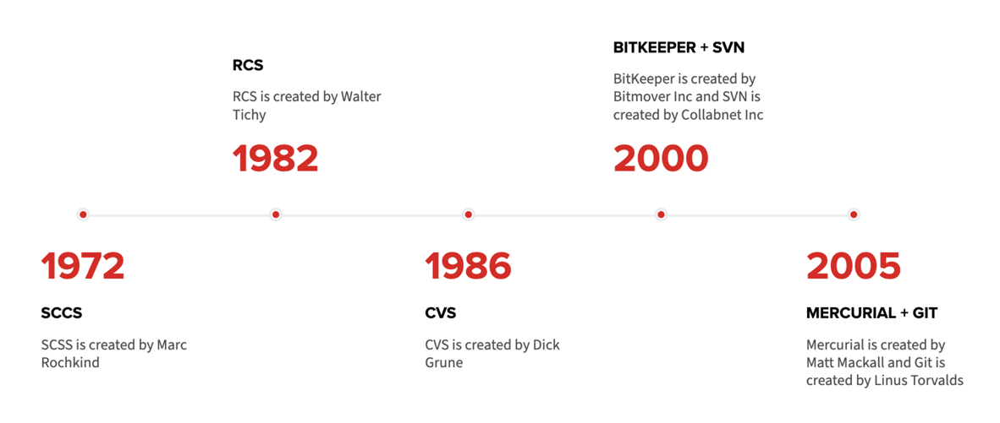
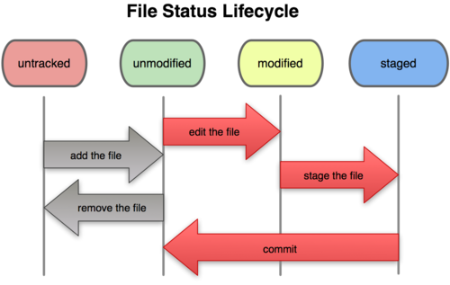

# Курс по Git

## Конспект

### История

* Системы контроля версий первого поколения (локальные файлы)
  * SCCS
  * RCS
* Системы контроля версий второго поколения (поддержка сети, удалённый сервер)
  * CVS
  * BitKeeper
  * SVN
* Системы контроля версий третьего поколения (несколько равнозначных репозиториев)
  * Git
  * Mercurial



#### Git 

* Разработан Линусом Торвальдсом в 2005 для написания ядра Линукса группой разработчиков. 
* Самая популярная в мире система управлениями версиями.
* Git является распределённой системой. Центрального репозитория не существует: все копии создаются равными.
* Разработчики могут вносить свои изменения в локальную копию репозитория без ведома других репозиториев. Это допускает коммиты без подключения к сети или интернету.

### Настройка окружения

Прежде чем начинать работу, нужно настроить окружение:

```bash
git config --global user.name "<ваш_ник_на_гитхабе>"
git config --global user.email "<адрес_почты@gmail.com>"
```

Основные понятия в Git:

* 


### Cоздание первого проекта

Cоздадим тестовый проектик:

```bash
git init sample-project
cd sample-project
```

Посмотрим, какие файлы у нас есть:
```bash
ls -a
```

Посмотрим, текущее состояние нашего репозитория:
```bash
git status
```

`git status` -- очень полезная команда, помогает понять, что происходит во многих случаях

### Закоммитим файл

Сделаем файл `README.md`
```
echo "I'm learning Git" >> README.md
```

Посмотрим, что у нас получилось:
```
git status
```

Добавим файл в индекс:
```
git add README.md
git status
```

Сделаем коммит:
```
git commit -m "docs: add README.md"
git status
```

### Состояния файлов в Git

* untracked
* umodified
* modified
* staged



### Добавим удалённый репозиторий

* Создадим удалённый репозиторий, используя GitHub веб-интерфейс
* Добавим удалённый репозиторий:
  ```bash
  git remote add origin https://github.com/<логин>/<имя-репы>
  ```
* Проверим, что всё успешно добавилось:
  ```bash
  git remote -v
  ```
* Запушим наши коммиты:
  ```bash
  git push
  ```
* Попробуем ещё раз
  ```bash
  git push --set-upstream origin main
  ```
* Сделаем ещё какой-нибудь коммит и запушим его:
  ```bash
  git push
  ```
  Как можно заметить, делать `git push --set-upstream origin main` не понадобилось.

### Получение новых коммитов из репозитория

* С помощью web-интерфейса изменим `README.md`
* Посмотрим на состояние репозитория до получения коммита:
  ```bash
  git log
  git status
  ```
* Получим изменения с удалённого репозитория:
  ```bash
  git pull --rebase origin 
  ```
* Посмотрим состояние репозитория сейчас:
  ```bash
  git log
  git status
  ```

### Коммиты и ветки

TODO

A commit is a snapshot in time. Each commit contains a pointer to its root tree, representing the state of the working directory at that time. The commit has a list of parent commits corresponding to the previous snapshots. A commit with no parents is a root commit and a commit with multiple parents is a merge commit. 

#### Ветки

TODO

### Создание веток

TODO

### Интерактивчик

Давайте попробуем вместе попушить в репозиторий, посмотрим что получится :)

TODO

git push -f

TODO

Закрыть ветку на пуш

### Merge конфликт

### Best practices

#### Conventional commits

TODO

#### Feature branches

No merge commits!

TODO

TODO

### Для чего можно использовать Git уже сегодня?

* Home page
* Хранение алгосиков из спортпроги
* Хранение посылок по задачам и условий задач
* Хранение CV
* Хранение pet-проджектов
* Хранение всякой инфы про учёбу

### Вторая часть курса

Плюшки GitHub:
* Pull Requests
* GitHub Actions
* Issues
* Discussions
* etc.

### Полезная информация

#### UI клиенты

TODO

#### Help

К любой команде можно добваить `--help` для вывода справки по этой команде:
```bash
git add --help
git commit --help
git checkout --help
git pull --help
```